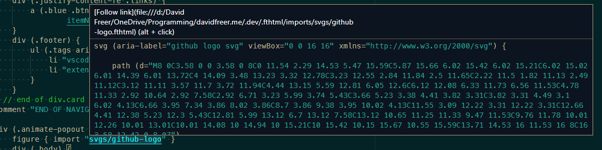

# Change Log

## [v4.0.0]

Complete extension overhaul that provides a proper fthtml language server in place of the inline
changes from versions prior.

With a proper language server the TL;DR of new features are as follows:

- Validator
- File autocomplete specific to ftHTML syntax
  - Supports imports, json and by reference prefixes
- Convert html to ftHTML on paste
- Document formatting
  - Added formating
  - Added more use cases for how braces are formatted
- Broader symbol support
- Document linking

Other changes:
- Removed fthtmlconfig requirement for exports
- Updated some syntax highlighting rules

### Validator:
The validator now executes any time there are file changes by default.
The configuration to disable the validator has moved to:
`fthtml.validation.enabled`

### Exporting

Moved the configurations to `fthtml.export`.

To enable/disable exporting on save functionality, use: `fthtml.export.onSave`

To clear the output everytime an export is started, use: `fthtml.export.clearOutput`

Added the option for the user to define how they want to be notified of failures with:

`fthtml.export.onErrorOutputMode`

  - prompt

    Show a UI notification and ask to 'View' the results
  - show

    Always show the output
  - problem-panel

    Report any issues in the problems panel

### File autocomplete:

Autocomplete is now supported for `import` and `json` keywords. This implementation is specific to ftHTML syntax and will automatically update depending on if you have an `importDir` configured in `fthtmlconfig` file or not, and it will also automatically update for by reference syntax, `&./`

### Convert HTML to ftHTML on paste

Now when you paste anything into an ftHTML document, it will try and detect if it's HTML or not. If it is HTML it will automatically be converted to ftHTML and formatted according to your personal format settings, otherwise it will be pasted as-is. You can use `ctrl+shift+p` at anytime to paste without converting.

To specify the quotation style for conversions you can use: `fthtml.format.onPasteHTML.quotationMark`

### Broader symbol support

Added parent identifiers and the option to filter symbols.

To filter tag names, use: `fthtml.includeTagNamesInSymbols`

### Document Linking

Added support for document links specific to how ftHTML imports work. You can now follow the link in an import call. Just like everything else, this honors by reference syntax.
You can disable this for whatever reason using via `fthtml.documentLinking.enabled`



### Formatting

Added a proper formatting implementation on save. The following new configurations are provided to the end user to customize their personal coding style:

Using the prefix `fthtml.format.`
- `enabled`: `boolean`
- `collapseSingleChildElements`: `boolean`

  This will collapse any elements that only have 1 child

  For example:

  ```
  li {
    a (href=main.html target=_blank) "Home"
  }
  ```

  Becomes when enabled:

  ```
  li { a (href=main.html target=_blank) "Home" }
  ```

- `collapseSingleChildElementsIfLineLengthLessThan`: `integer`

  Specify the maximum number of characters a line can contain to be eligible for collapsing

- `skipTagNamesForCollapsing`: `string[]`

  Specify which tags will be omitted from collapsing regardless of other settings.

  Default is `["pre", "code"]`

- `alignVariableOrPropertyBindingValues`: `boolean`

  This property aligns the values of variable declarations and import property binding.

  For example:

  ```
  #vars
    author "David Freer"
    foo "bar"
    githubLink "https://github.com/soulshined"
  #end
  ```

  Becomes when enabled:

  ```
  #vars
    author     "David Freer"
    foo        "bar"
    githubLink "https://github.com/soulshined"
  #end
  ```

  Same for import property binding


- `newLineBeforeComments`: `boolean`

  Force a new line before comments

- `newLineBeforeFirstChildElement`: `boolean`

  Force a new line on the first child of a parent element

  For example:

  ```
  div
  {
    div(#child1) "a"
    div(#child2) "b"
    div(#child3) "c"
  }
  ```

  Becomes when enabled:

  ```
  div
  {

    div(#child1) "a"
    div(#child2) "b"
    div(#child3) "c"
  }
  ```

- `newLineAfterLastChildElement`: `boolean`


  Force a new line after the last child of a parent element

  For example:

  ```
  div
  {
    div(#child1) "a"
    div(#child2) "b"
    div(#child3) "c"
  }
  ```

  Becomes when enabled:

  ```
  div
  {
    div(#child1) "a"
    div(#child2) "b"
    div(#child3) "c"

  }
  ```

- `newLineBeforeAfterChildElementMinimumDepth`

  Specifies the minimum child depth before new lines are forced before first and after last child element.

  For example, if the minimum depth was 2:

  ```
  html
  {
    body
    {

      h1 "Hello World"
      p "Foo bar"

    }
    footer
    {

      @sitelink

    }
  }
  ```

- `newLineBeforeAfterChildElementMaximumDepth`

  Specifies the maximum child depth before new lines are forced before first and after last child element.

  For example, if the minimum depth was 1 and the maximum is 1:

  ```
  html
  {

    body
    {
      h1 "Hello World"
      p "Foo bar"
    }
    footer
    {
      @sitelink
    }

  }
  ```

- `braces`

  - `newLineAfterElement`: `boolean`

    Add a new line after an element

    ```
    div
    {

    }
    ```

  - `newLineAfterAttributes`: `boolean`

    Add a new line after an element with attributes

    ```
    div (#myId .class1 .class2)
    {

    }
    ```

  - `newLineAfterEmbeddedLangs`: `boolean`

    ```
    js
    {
      const myVar = "foobar";
      console.log(myVar);
    }
    ```

  - `newLineAfterImport`: `boolean`

    Add a new line after an import statement

    ```
    import "somefile"
    {
      prop1 "some val"
      prop2 "some val"
    }
    ```

  - `newLineAfterVariableOrPropertyBinding`: `boolean`

    Add a new line after a variable fthtml block or an import property binding fthtml block value

    ```
    import "somefile"
    {
      prop1 "some val"
      prop2 "some val"
      prop3
      {
        a (href=example.com target=_blank) "foobar"
      }
    }
    ```

  <br>

  - `addIdentifierCommentAfterClosingBrace`: `boolean`

    Automatically add a line comment after the closing brace. This dynamically generates depending on the attributes provided

    ```
    div (#overlay)
    {
      ......
    } // end of div#overlay
    ```

    Note: This does not regenerate if attributes change

  - `minimumNumberOfLinesToAddIdentifierComment`: `integer`

    Specifies how many number of lines must be between the braces of a parent element before adding the identifier comment

    For example, if the minimum number of lines is 4:

    ```
    div {
      h1 "Hello World"
    }

    div (#myDiv)
    {
      h1 "Hello World"
      p "Foo bar"
      p "Foo"
      p "Bar"
      p "Baz"
    } // end of div#myDiv
    ```

  - `skipTagNamesForCommentAfterClosingBrace`: `string[]`

    Specifies which elements to skip for adding an identifier comment, regardless of other settings

    Default is mostly all of the inline elements

- `attributes`
  - `addSpaceBeforeAttributeParenthesis`: `boolean`

    Force a space after an element before attributes:

    ```
    div (#myDiv)
    ```

  - `padAttributesWithSpace`: `boolean`

    Pad attributes with spaces:

    ```
    div( #myDiv )
    ```

  - `order`: `enum`

    Specifies the order of attributes. Default : `"id, class, kvp, misc"`

    This means attributes will re-arrange to the specified order if they are not already in that order

  - `sorted`: `boolean`

    Alphabetically sort attribute groups (meaning classes are sorted by classes and key-value pairs are sorted accordingly to similar kvps)

    ```
    div (#myDiv .fooClass .barClass src=example.com data-tag=foobar)
    ```

    Becomes, when enabled:

    ```
    div (#myDiv .barClass .fooClass data-tag=foobar src=example.com)
    ```

  - `wrapOrderedAttributes`: `boolean`

    Force attributes to wrap to new lines according to their grouping


    ```
    div (#myDiv .fooClass .barClass src=example.com data-tag=foobar)
    ```

    Becomes, when enabled

    ```
    div (#myDiv
         .fooClass .barClass
         src=example.com data-tag=foobar)
    ```

  - `minimumNumberOfAttributesForWrapping`: 6

    Specifies the minimum number of attributes needed before forcing them to wrap

## [v3.0.2]

- Added a global setting for defining your preferred shell to use for converting files by calling the
node execuatable. For macs this defaults to '/usr/local/bin', for windows it uses the default process

- Fixed a syntax highlighting issue for unintentionally reporting child elements as errors

## [v3.0.0]

- Support for ftHTML 3.0.0
  > NOTE: This is a breaking update since templates have been removed. Please update after reading the
  > documentation: https://www.fthtml.com/changelog/#Smaragdine

- Add code action
  - Quickly convert a simple element to a parent element
- Add suggestions (autocomplete) for all language specific features
  - Macros
  - Functions
  - Embedded Langs
  - Keywords
- Added hover documentation and suggestion details
- Added search by symbol (variables and imports are considered symbols)
- Added 'GoTo Definition' and 'Peek Definitions' functionality for import files and variables
  - This works with the new 'by reference' imports as well
- fthtmlconfig.json
  - Removed `templateDir` (templates are now called with the `importDir` as well)
  - Add `jsonDir`
  - Add `prettify` to define if the output file should be minified or not
  - Add `globalvars` (define variables here and then call these variables from any file)
- Small formatting implementation
- Added '#region' to the code folding strategy
- Removed dark and light default altered themes now that vscode allows editing tokens from settings.

### Roadmap:

- A complete custom formatter
- File name autocomplete for import/templates/json
- An HTML to ftHTML converter on copy/paste
- Better 'Problems' identifier and diagnostic information

## [v2.2.4]
- Update to support ftHTML v2.1.5

## [v2.2.3]
- Fixes issue for mac/linux users

## [v2.2.2]
- Supports fthtml v2.1.1
- Changed the convert process from global bin to a local call so you will always be using the version relative to what the extension uses now.

## [v2.2.1]
- Support for fthtml v2.1.0

  see www.fthtml.com for documentation and changes

## [v2.0.0]
- Support for fthtml v2.0.0
  IMPORTANT: Do not update to 2.0.0 until you have reviewed the docs for fthtml 2.0.
  Some changes for future support of features may break your syntax, or cause weird color coding

  see www.fthtml.com for documentation and changes

## [v1.1.0]
-  Support for fthtml v1.0.2

## [v1.0.3]
-  Refreshed file extension icon

## [v1.0.0]
- Initial release