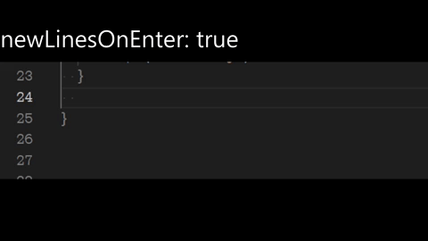
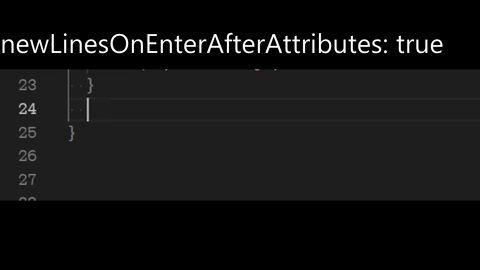
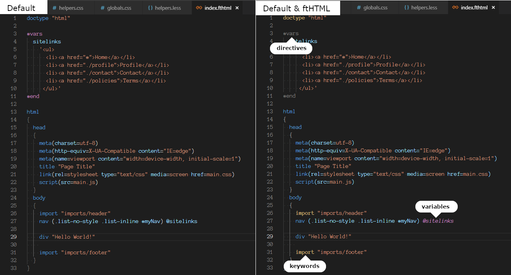
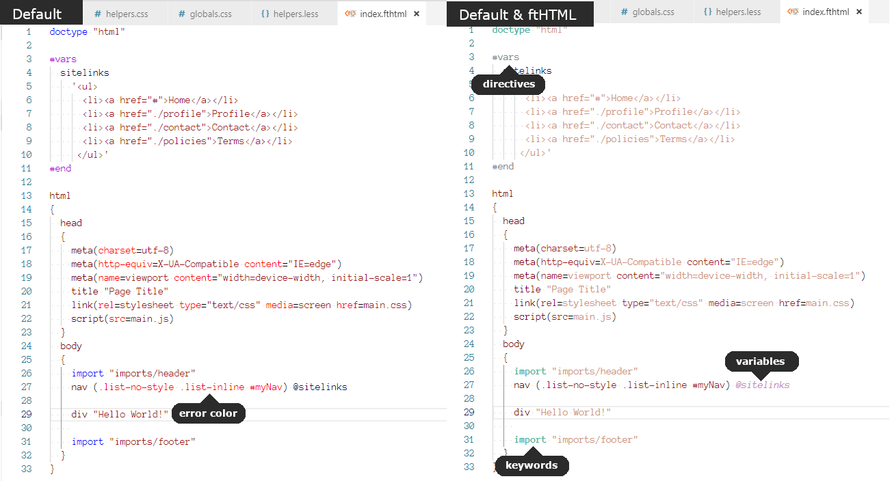
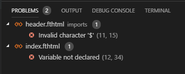

# ftHTML

This extensions provides language support for [ftHTML preprocesser](https://www.npmjs.com/package/fthtml)

Support includes, but not limited to:

* [Configurations](#configurations) 
* [UI Themes](#ui-themes) 
* [Icon Theme](#icon-theme) 
* [Syntax Highlighting](#syntax-highlighting) 
* [Syntax Validation](#syntax-validation) 
* [Snippets](#snippets) 


## Configurations
[[top]](#fthtml)

This extension contributes the following settings (prefix them with `fthtml`):

* `format.braces.newLinesOnEnter`:
  > Specify if you want your braces to go to a new line after pressing 'Enter' directly after curly braces auto-completion (à la C#)

  
* `format.braces.newLinesOnEnterAfterAttributes`:
  > Specify if you want your braces to go to a new line after pressing 'Enter' directly after curly braces auto-complemention when the ftHTML element has an attributes group (à la C#)
  
  
* `validateOnSave`:
  > Everytime you save a ftHTML file it will be validated by the ftHTML parser. The first found issue will be reported in the 'Problems' panel for each file validated. 

  > Please note this happens any time you open an ftHTML file as well, which can not be disabled at this time.

## UI Themes
[[top]](#fthtml)

Although I can't possibly add support for all the UI Themes out there, I decided to extend the default VS Code themes. 

For example, if you use the Dark+ (default dark) or Light+ (deafult light) Visual Studio Code Themes, you can simply add personalized syntax highlighting for ftHTML, while keeping the same UI theme. The following examples demonstrate the differences:

**Dark:**


**Light:**


> Future support will allow you to customize the token colors permanently via workspace/user settings, I just wanted to get an initial extension pushed out

## Icon Theme
[[top]](#fthtml)

An icon does not show up in the solution explorer treeview for any `.fthtml` files because its not a natively recognized language extension yet. If you would like to enable a file icon for .ftHTML files and are already using the Seti theme (that's enabled by default when using visual studio code), I extended the vs-seti-icon theme. I didn't change anything but add an icon for `.fthtml` files.

To enable this type this in your command palette:

> \>Preferences: File Icon Theme

And select *Seti (Visual Studio Code & ftHTML)*

## Syntax Highlighting
[[top]](#fthtml)

If you do not want to use one of the [UI themes](#ui-themes) noted above for a more personalize ftHTML experience, I tried to keep the language descriptors as close to the tmLanguage standards as possible, thereby ensuring a generic color-coded support. However, if you notice a UI Theme not correctly supporting ftHTML scopes according to the tmLanguage standards, you would need to discuss with the extension dev to include it.

## Syntax Validation
[[top]](#fthtml)

Your fthtml markup is validated on every save ([configurable](#configurations)) or everytime you open an `.fthtml` file. This is to not be confused with a linter. The difference is this will stop validating on the first error found and report it to the 'Problems' Panel. The import thing to address here is this does not also validate imported files/templates when expressed in the syntax:

```
 div "hello world"

 import "imports/footer"
```

The *"imports/footer"* file's syntax gets omitted when validating

Example output:



## Snippets
[[top]](#fthtml)

The following snippets can be used to quickly insert text:

* `vars` - Produces a vars directive environment for defining variables (includes closing)
* `html` - Produces a complete HTML5 equivalent template
* `comment` - comment "$"
* `doctype` - doctype "$"
* `import` - import "$"

**Enjoy!**
